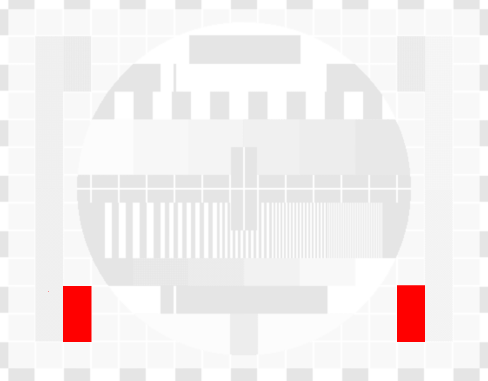
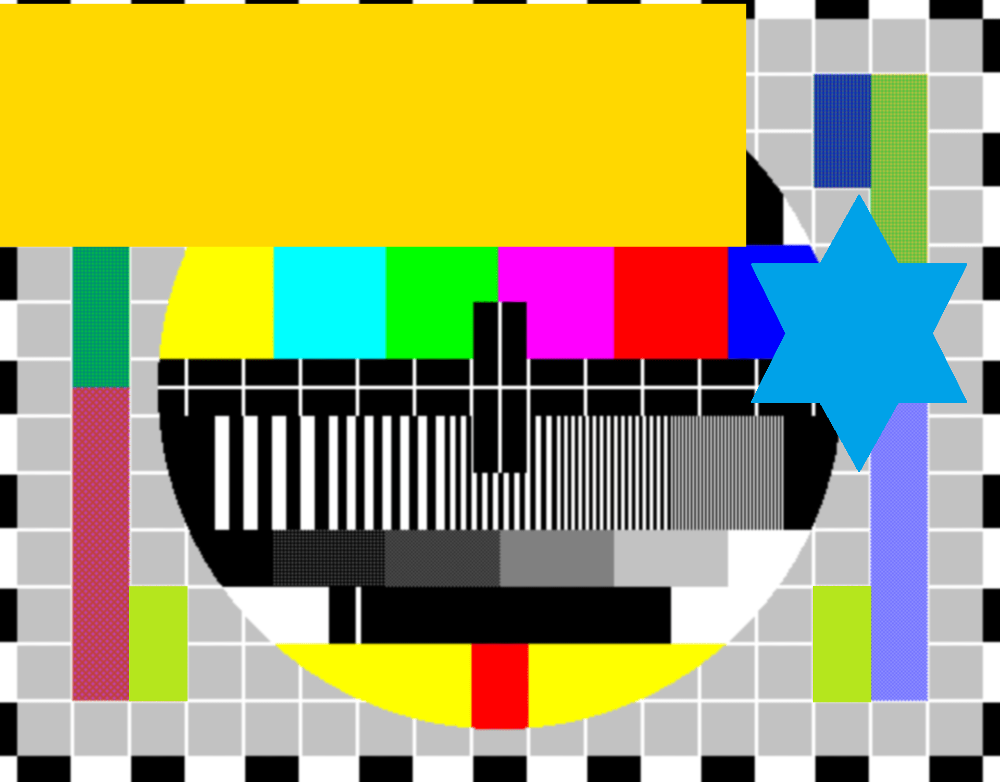
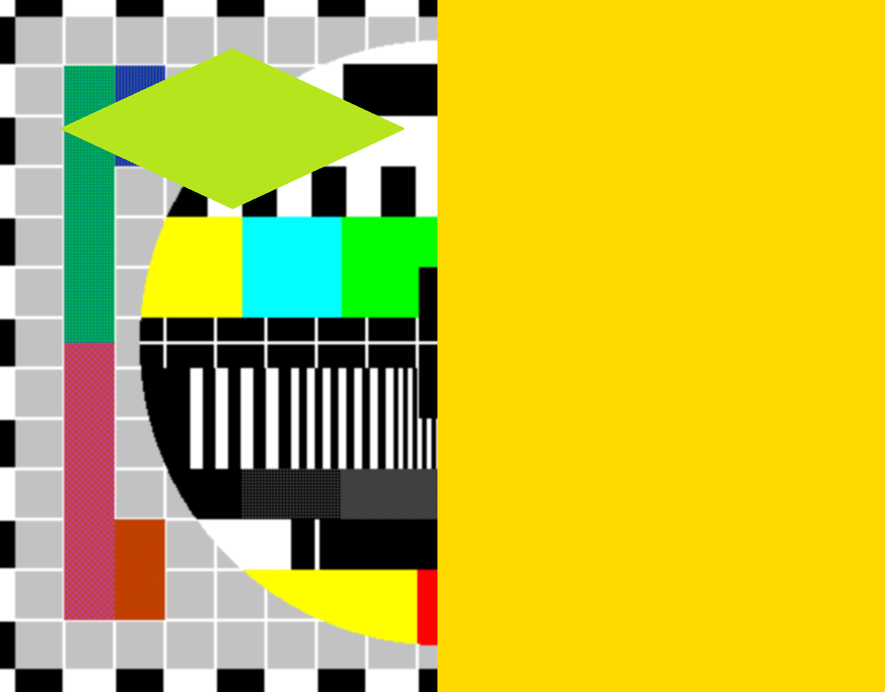
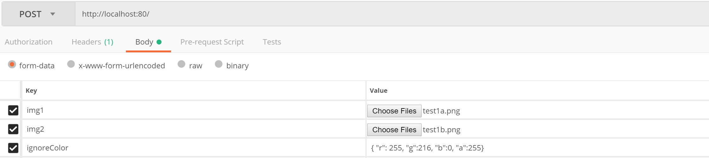

# imagediff
## Purpose
Imagediff determines the differences between two images:
| First input image  | Second input image | Detected differences |
| ------------- | ------------- |------------- |
|   |   ||

You can tell it to ignore certain areas in the images. Choose some random color, cover up those areas in either of the images and supply the RGBA values of the selected color (see later how to supply the RGBA values)
| First input image  | Second input image | Result showing the difference |
| ------------- | ------------- |------------- |
|   |  |   |

## Running it as a standalone tool
It can run as a standalone commandline tool like this:
```shell
.\image-diff.exe  --img1 .\examples\test1a.png --img2 .\examples\test1b.png --output .\examples\test1-result.png
```
It outputs a single CSV line to the console with the input images, number of different pixels and location of output image:
```csv
.\examples\test1a.png,.\examples\test1b.png,49841,.\examples\test1-result.png
```

Specify the ignore color on the commandline as follows:
```shell
.\image-diff.exe  --img1 .\examples\test-ignorecolor-1.png --img2 .\examples\test-ignorecolor-2.png --output .\examples\test-ignorecolor-result.png -ignoreR 255 -ignoreG 216 -ignoreB 0
```

## Running it as a REST service
### Start the tool
The tool can also run as a REST webservice.
```shell
.\image-diff.exe
Listening on 0.0.0.0:80
#It also accepts and IP:Port argument
.\image-diff.exe -listen 10.0.0.1:1234
Listening on 10.0.0.1:1234
```
or run it as a container with docker
```shell
docker run -d --rm -p80:80 adrichem/image-diff:latest -listen 0.0.0.0:80
```
### Check that its running
If you want to check whether the service is ready for use, you can GET the `/status` endpoint. It returns HTTP 200 when its ready for use. 

### Send images and check the response headaers and body for results
Post the images as a multipart form. The service responds with:
1. a body containing the difference image.
2. a response header containing the number of different pixels.

#### Example with postman
| Headers  | Body | 
| ------------- | ------------- |------------- |
|   |   |

#### Example in C#
```csharp
	var form = new MultipartFormDataContent();
	StreamContent img1 = new StreamContent(StreamToYourFirstImage);
	StreamContent img2 = new StreamContent(StreamToYourSecondImage);

	img1.Headers.ContentDisposition = new ContentDispositionHeaderValue("form-data")
	{
		FileName = "img1.png",
		Name = "img1",
	};
	img1.Headers.ContentType = new MediaTypeHeaderValue("image/png");
	form.Add(img1);

	img2.Headers.ContentDisposition = new ContentDispositionHeaderValue("form-data")
	{
		FileName = "img2.png",
		Name = "img2",
	};
	img2.Headers.ContentType = new MediaTypeHeaderValue("image/png");
	form.Add(img2);
	
	form.Add(new StringContent( "{ \"r\":255, \"g\":216, \"b\":0 }"), "ignoreColor");

	var request = new HttpRequestMessage()
	{
		RequestUri = new Uri("http://localhost/"),
		Method = HttpMethod.Post,
		Content = form,
	};
```